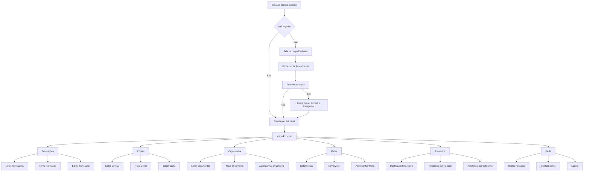
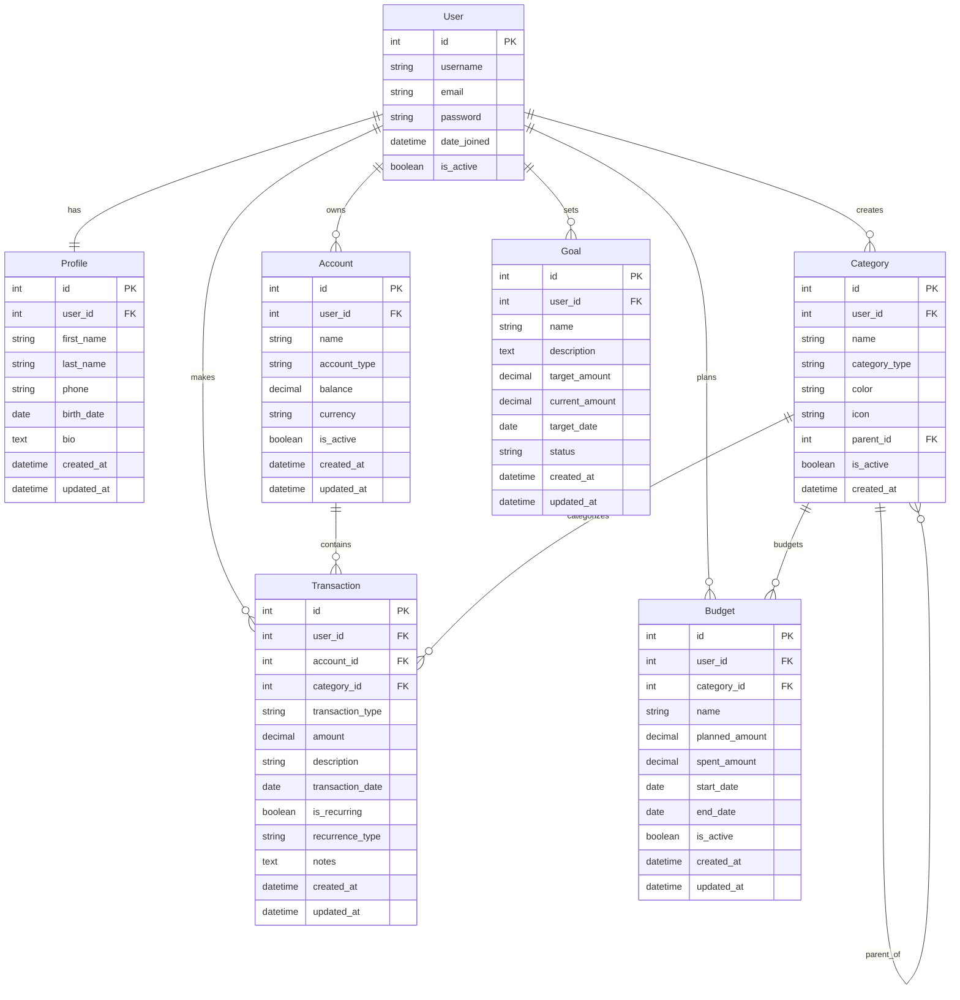

# PRD - Finanpy
## Sistema de Gestão de Finanças Pessoais

---

## 1. Visão Geral

O Finanpy é um sistema web de gestão de finanças pessoais desenvolvido em Python/Django, projetado para ajudar usuários a controlar suas receitas, despesas, orçamentos e metas financeiras de forma simples e intuitiva. O sistema oferece uma interface moderna com design responsivo em tema escuro, focando na simplicidade de uso e eficiência no controle financeiro.

## 2. Sobre o Produto

O Finanpy é uma aplicação web full-stack que permite aos usuários:
- Gerenciar contas bancárias e cartões
- Registrar e categorizar transações financeiras
- Criar e acompanhar orçamentos mensais
- Definir e monitorar metas de economia
- Visualizar relatórios e gráficos financeiros
- Manter um perfil personalizado com preferências

## 3. Propósito

Proporcionar uma ferramenta completa e acessível para controle financeiro pessoal, permitindo que os usuários tenham visibilidade clara de sua situação financeira, tomem decisões informadas e alcancem seus objetivos de economia e investimento.

## 4. Público Alvo

### Primário:
- Jovens adultos (20-35 anos) que estão iniciando vida financeira independente
- Profissionais que desejam organizar melhor suas finanças pessoais
- Pessoas que buscam uma ferramenta simples para controle de gastos

### Secundário:
- Estudantes universitários aprendendo educação financeira
- Autônomos e freelancers que precisam separar finanças pessoais
- Qualquer pessoa interessada em melhorar sua gestão financeira

## 5. Objetivos

### Objetivos de Negócio:
- Criar uma ferramenta intuitiva de gestão financeira
- Estabelecer base de usuários engajados
- Demonstrar valor através de insights financeiros claros

### Objetivos do Usuário:
- Ter controle total sobre receitas e despesas
- Visualizar padrões de gastos por categoria
- Estabelecer e cumprir metas de economia
- Criar orçamentos realistas e acompanhar execução

## 6. Requisitos Funcionais

### 6.1 Autenticação e Usuários
- Sistema de cadastro e login
- Login por email ao invés de username
- Recuperação de senha
- Perfil do usuário com informações pessoais

### 6.2 Gestão de Contas
- Cadastro de contas bancárias e cartões
- Definição de saldo inicial
- Visualização de saldo atual

### 6.3 Categorias
- Categorias pré-definidas para receitas e despesas
- Possibilidade de criar categorias personalizadas
- Organização hierárquica de categorias

### 6.4 Transações
- Registro de receitas e despesas
- Associação com conta e categoria
- Suporte a transações recorrentes
- Anexo de comprovantes (opcional)

### 6.5 Orçamentos
- Criação de orçamentos mensais por categoria
- Comparação entre orçado vs realizado
- Alertas de limite de gastos

### 6.6 Metas Financeiras
- Definição de metas de economia
- Acompanhamento de progresso
- Prazo para alcançar objetivos

### 6.7 Relatórios e Dashboards
- Dashboard principal com visão geral
- Gráficos de receitas vs despesas
- Relatórios por período e categoria
- Evolução do patrimônio

### 6.8 Flowchart de UX

## 7. Requisitos Não-Funcionais

### 7.1 Performance
- Tempo de resposta < 2 segundos para operações básicas
- Suporte a até 1000 usuários simultâneos
- Interface responsiva em dispositivos móveis

### 7.2 Usabilidade
- Interface intuitiva com no máximo 3 cliques para funções principais
- Design consistente seguindo padrões de UI/UX
- Suporte a telas de 320px até 1920px de largura

### 7.3 Segurança
- Autenticação segura com hash de senhas
- Sessões com timeout automático
- Validação de dados de entrada

### 7.4 Compatibilidade
- Suporte aos navegadores Chrome, Firefox, Safari e Edge
- Responsividade para desktop, tablet e mobile

### 7.5 Manutenibilidade
- Código seguindo padrões PEP8
- Estrutura modular com apps Django separados
- Documentação clara do código

## 8. Arquitetura Técnica

### 8.1 Stack Tecnológica

**Backend:**
- Python 3.13+
- Django 5.0+ (Framework web)
- SQLite (Banco de dados)
- Django Authentication System

**Frontend:**
- Django Templates
- TailwindCSS (Estilização)
- JavaScript Vanilla (Interações)
- Chart.js (Gráficos)

**Infraestrutura:**
- Servidor de desenvolvimento Django
- Arquivos estáticos servidos pelo Django

### 8.2 Estrutura de Dados

## 9. User Stories

### Épico 1: Gestão de Usuários e Autenticação
**Como** um usuário novo
**Quero** me cadastrar e fazer login no sistema
**Para** acessar minhas informações financeiras de forma segura

#### Critérios de Aceite:
- [ ] Sistema permite cadastro com email e senha
- [ ] Validação de formato de email e força da senha
- [ ] Login com email/username e senha
- [ ] Opção "Lembrar-me" para sessões persistentes
- [ ] Funcionalidade de recuperação de senha por email
- [ ] Logout seguro com limpeza de sessão

### Épico 2: Gestão de Contas Financeiras
**Como** um usuário logado
**Quero** cadastrar e gerenciar minhas contas bancárias e cartões
**Para** ter controle sobre todos os meus recursos financeiros

#### Critérios de Aceite:
- [ ] Cadastro de contas com nome, tipo e saldo inicial
- [ ] Edição de informações das contas
- [ ] Visualização de saldo atual por conta
- [ ] Inativação de contas (não exclusão)
- [ ] Listagem de todas as contas do usuário

### Épico 3: Sistema de Categorias
**Como** um usuário
**Quero** organizar minhas transações em categorias
**Para** entender melhor meus padrões de gastos

#### Critérios de Aceite:
- [ ] Categorias pré-definidas para receitas e despesas
- [ ] Criação de categorias personalizadas
- [ ] Edição e inativação de categorias
- [ ] Organização hierárquica (categorias pai e filhas)
- [ ] Atribuição de cores e ícones às categorias

### Épico 4: Registro de Transações
**Como** um usuário
**Quero** registrar todas as minhas receitas e despesas
**Para** manter um controle detalhado das minhas finanças

#### Critérios de Aceite:
- [ ] Registro de transações com valor, categoria, conta e data
- [ ] Classificação como receita ou despesa
- [ ] Campo para descrição/observações
- [ ] Edição e exclusão de transações
- [ ] Listagem com filtros por período, categoria e conta
- [ ] Atualização automática do saldo das contas

### Épico 5: Planejamento Orçamentário
**Como** um usuário
**Quero** criar orçamentos mensais por categoria
**Para** controlar meus gastos e alcançar metas financeiras

#### Critérios de Aceite:
- [ ] Criação de orçamentos com valores planejados por categoria
- [ ] Visualização do progresso (gasto vs orçado)
- [ ] Alertas quando próximo ao limite
- [ ] Comparação entre meses diferentes
- [ ] Relatório de execução orçamentária

### Épico 6: Metas Financeiras
**Como** um usuário
**Quero** definir metas de economia
**Para** me motivar a alcançar objetivos financeiros específicos

#### Critérios de Aceite:
- [ ] Criação de metas com valor alvo e prazo
- [ ] Acompanhamento do progresso em tempo real
- [ ] Visualização gráfica da evolução
- [ ] Notificações de marcos importantes
- [ ] Histórico de metas concluídas

### Épico 7: Relatórios e Dashboard
**Como** um usuário
**Quero** visualizar relatórios e gráficos das minhas finanças
**Para** tomar decisões informadas sobre meu dinheiro

#### Critérios de Aceite:
- [ ] Dashboard com resumo financeiro atual
- [ ] Gráficos de receitas vs despesas
- [ ] Relatórios por categoria e período
- [ ] Evolução do patrimônio líquido
- [ ] Exportação de relatórios em PDF/CSV

## 10. Lista de Tarefas

### Sprint 1: Configuração Inicial e Autenticação (2 semanas) ✅

#### Tarefa 1.1: Setup do Projeto ✅
- [X] **1.1.1** Criar projeto Django com estrutura de apps
  - [X] Inicializar projeto `django-admin startproject core .`
  - [X] Criar apps: users, profiles, accounts, categories, transactions, budgets, goals
  - [X] Configurar INSTALLED_APPS no settings.py
- [X] **1.1.2** Configurar TailwindCSS
  - [X] Instalar via CDN no template base
  - [X] Configurar tema escuro como padrão
  - [X] Definir paleta de cores gradient
- [X] **1.1.3** Configurar arquivos estáticos e media
  - [X] Configurar STATIC_URL e STATICFILES_DIRS
  - [X] Criar estrutura de templates base
  - [X] Configurar MEDIA_URL e MEDIA_ROOT

#### Tarefa 1.2: Sistema de Usuários ✅
- [X] **1.2.1** Configurar modelo de usuário customizado
  - [X] Criar modelo User herdando de AbstractUser
  - [X] Configurar AUTH_USER_MODEL no settings
  - [X] Criar e executar migrações
- [X] **1.2.2** Implementar views de autenticação
  - [X] LoginView customizada com template
  - [X] LogoutView com redirecionamento
  - [X] SignUpView para cadastro
  - [X] PasswordResetView para recuperação
- [X] **1.2.3** Criar templates de autenticação
  - [X] Template base com navbar responsiva
  - [X] Formulário de login estilizado
  - [X] Formulário de cadastro
  - [X] Páginas de recuperação de senha

#### Tarefa 1.3: App Profiles ✅
- [X] **1.3.1** Criar modelo Profile
  - [X] OneToOneField com User
  - [X] Campos: first_name, last_name, phone, birth_date, bio
  - [X] Timestamps created_at, updated_at
- [X] **1.3.2** Implementar ProfileDetailView e ProfileUpdateView
  - [X] View para exibir perfil do usuário
  - [X] Form para edição de dados pessoais
  - [X] Template responsivo para perfil
- [X] **1.3.3** Configurar signal para criação automática de perfil
  - [X] Signal post_save do User para criar Profile
  - [X] Testes de criação automática

### Sprint 2: Contas e Categorias (2 semanas) ✅

#### Tarefa 2.1: App Accounts (Contas Financeiras) ✅
- [X] **2.1.1** Criar modelo Account
  - [X] ForeignKey para User
  - [X] Campos: name, account_type, balance, currency, is_active
  - [X] Choices para tipos de conta (checking, savings, credit_card, etc.)
- [X] **2.1.2** Implementar CRUD de contas
  - [X] AccountListView para listagem
  - [X] AccountCreateView para cadastro
  - [X] AccountUpdateView para edição
  - [X] AccountDeleteView (soft delete)
- [X] **2.1.3** Templates para gestão de contas
  - [X] Lista de contas com cards responsivos
  - [X] Formulário de cadastro/edição
  - [X] Modal de confirmação para exclusão

#### Tarefa 2.2: App Categories ✅
- [X] **2.2.1** Criar modelo Category
  - [X] ForeignKey para User
  - [X] Campos: name, category_type, color, icon, parent_id
  - [X] Self-referencing FK para hierarquia
- [X] **2.2.2** Seed de categorias padrão
  - [X] Management command para criar categorias iniciais
  - [X] Categorias de receita e despesa pré-definidas
  - [X] Cores e ícones padrão
- [X] **2.2.3** CRUD de categorias
  - [X] CategoryListView hierárquica
  - [X] CategoryCreateView com seleção de pai
  - [X] CategoryUpdateView preservando hierarquia
  - [X] Validação para evitar loops na hierarquia

### Sprint 3: Transações (3 semanas) ✅

#### Tarefa 3.1: Modelo de Transações ✅
- [X] **3.1.1** Criar modelo Transaction
  - [X] ForeignKeys para User, Account, Category
  - [X] Campos: transaction_type, amount, description, transaction_date
  - [X] Campos opcionais: notes, is_recurring, recurrence_type
- [X] **3.1.2** Implementar validações de negócio
  - [X] Validação de valores positivos
  - [X] Validação de datas (não futuras para transações normais)
  - [X] Validação de conta ativa
- [X] **3.1.3** Signals para atualização de saldos
  - [X] Signal post_save para somar/subtrair do saldo da conta
  - [X] Signal post_delete para reverter alterações no saldo
  - [X] Tratamento de edições de transações

#### Tarefa 3.2: Views de Transações ✅
- [X] **3.2.1** TransactionListView com filtros
  - [X] Listagem paginada de transações
  - [X] Filtros por período, categoria, conta, tipo
  - [X] Ordenação por data (mais recentes primeiro)
- [X] **3.2.2** TransactionCreateView
  - [X] Formulário com validação client-side
  - [X] Seleção dinâmica de categorias por tipo
  - [X] Campo de valor com formatação de moeda
- [X] **3.2.3** TransactionUpdateView e DeleteView
  - [X] Edição com preservação de histórico
  - [X] Exclusão com confirmação
  - [X] Logs de auditoria para alterações

#### Tarefa 3.3: Templates de Transações ✅
- [X] **3.3.1** Lista responsiva de transações
  - [X] Cards com informações essenciais
  - [X] Cores diferentes para receitas/despesas
  - [X] Ícones das categorias
- [X] **3.3.2** Modal de transação rápida
  - [X] Formulário simplificado para adição rápida
  - [X] Campos essenciais apenas
  - [X] Validação em tempo real
- [X] **3.3.3** Página de detalhes da transação
  - [X] Visualização completa com todos os campos
  - [X] Botões para editar/excluir
  - [X] Histórico de alterações (se aplicável)

### Sprint 4: Orçamentos (2 semanas)

#### Tarefa 4.1: Modelo de Orçamentos
- [ ] **4.1.1** Criar modelo Budget
  - [ ] ForeignKeys para User e Category
  - [ ] Campos: name, planned_amount, spent_amount, start_date, end_date
  - [ ] Campo calculado para percentage_used
- [ ] **4.1.2** Método para cálculo de gastos
  - [ ] Property no modelo para calcular spent_amount automaticamente
  - [ ] Agregação de transações por período e categoria
  - [ ] Cache de valores calculados para performance

#### Tarefa 4.2: Views de Orçamentos  
- [ ] **4.2.1** BudgetListView com progresso
  - [ ] Cards mostrando progresso visual (barras)
  - [ ] Cores diferenciadas por status (verde/amarelo/vermelho)
  - [ ] Filtro por período
- [ ] **4.2.2** BudgetCreateView e UpdateView
  - [ ] Formulário com seleção de categorias
  - [ ] Validação de datas e valores
  - [ ] Preview de orçamento baseado em histórico

#### Tarefa 4.3: Templates de Orçamentos
- [ ] **4.3.1** Dashboard de orçamentos
  - [ ] Visão geral com todos os orçamentos ativos
  - [ ] Gráficos de progresso
  - [ ] Alertas para orçamentos próximos do limite
- [ ] **4.3.2** Formulários responsivos
  - [ ] Criação/edição com UX otimizada
  - [ ] Validação client-side
  - [ ] Feedback visual imediato

### Sprint 5: Metas Financeiras (2 semanas)

#### Tarefa 5.1: Modelo de Metas
- [ ] **5.1.1** Criar modelo Goal
  - [ ] ForeignKey para User
  - [ ] Campos: name, description, target_amount, current_amount, target_date
  - [ ] Status choices: active, completed, paused, cancelled
- [ ] **5.1.2** Métodos de cálculo de progresso
  - [ ] Property para percentage_complete
  - [ ] Cálculo de valor médio necessário por mês
  - [ ] Estimativa de conclusão baseada no histórico

#### Tarefa 5.2: Views de Metas
- [ ] **5.2.1** GoalListView com cards de progresso
  - [ ] Visualização em grid responsivo
  - [ ] Barras de progresso animadas
  - [ ] Cores baseadas no status
- [ ] **5.2.2** GoalDetailView com histórico
  - [ ] Página detalhada da meta
  - [ ] Gráfico de evolução temporal
  - [ ] Sugestões para alcançar a meta

#### Tarefa 5.3: Sistema de Contribuições para Metas
- [ ] **5.3.1** Funcionalidade para adicionar valores às metas
  - [ ] Form para contribuições avulsas
  - [ ] Vinculação com transações existentes
  - [ ] Histórico de contribuições
- [ ] **5.3.2** Automação de metas baseada em economia
  - [ ] Regras para contribuição automática
  - [ ] Porcentagem da sobra mensal
  - [ ] Transferência de valores excedentes do orçamento

### Sprint 6: Dashboard e Relatórios (2 semanas)

#### Tarefa 6.1: Dashboard Principal
- [ ] **6.1.1** Home page com resumo financeiro
  - [ ] Cards com saldo total, receitas e despesas do mês
  - [ ] Gráfico de pizza para distribuição de gastos
  - [ ] Lista das últimas transações
- [ ] **6.1.2** Widgets interativos
  - [ ] Progressos de orçamentos em destaque
  - [ ] Próximas metas a vencer
  - [ ] Alertas importantes
- [ ] **6.1.3** Gráficos com Chart.js
  - [ ] Gráfico de linha para evolução mensal
  - [ ] Barras comparativas de receitas vs despesas
  - [ ] Rosca para distribuição por categoria

#### Tarefa 6.2: Relatórios Avançados
- [ ] **6.2.1** ReportView genérica
  - [ ] Filtros por período customizável
  - [ ] Seleção de contas e categorias
  - [ ] Opções de agrupamento (mensal, semanal, diário)
- [ ] **6.2.2** Relatório de Fluxo de Caixa
  - [ ] Entradas vs Saídas por período
  - [ ] Projeções baseadas em médias
  - [ ] Identificação de tendências
- [ ] **6.2.3** Análise por Categorias
  - [ ] Top categorias de gastos
  - [ ] Comparação entre períodos
  - [ ] Percentual de cada categoria no total

#### Tarefa 6.3: Exportação de Dados
- [ ] **6.3.1** Export para CSV
  - [ ] Transações com todos os campos
  - [ ] Filtros aplicados na exportação
  - [ ] Formatação adequada para Excel
- [ ] **6.3.2** Export para PDF (opcional)
  - [ ] Relatórios formatados para impressão
  - [ ] Gráficos inclusos no PDF
  - [ ] Layout profissional

### Sprint 7: Melhorias de UX/UI e Finalização (1 semana)

#### Tarefa 7.1: Polimento da Interface
- [ ] **7.1.1** Revisão de responsividade
  - [ ] Testes em diferentes tamanhos de tela
  - [ ] Ajustes de layout mobile
  - [ ] Otimização de carregamento
- [ ] **7.1.2** Microinterações
  - [ ] Animações suaves em transições
  - [ ] Feedback visual para ações do usuário
  - [ ] Loading states para operações assíncronas
- [ ] **7.1.3** Acessibilidade
  - [ ] Alt texts para imagens
  - [ ] Navegação por teclado
  - [ ] Contraste adequado de cores

#### Tarefa 7.2: Performance e Otimização
- [ ] **7.2.1** Otimização de queries
  - [ ] select_related e prefetch_related onde necessário
  - [ ] Índices em campos frequentemente consultados
  - [ ] Paginação eficiente
- [ ] **7.2.2** Caching estratégico
  - [ ] Cache de templates frequentes
  - [ ] Cache de cálculos pesados
  - [ ] Otimização de assets estáticos

#### Tarefa 7.3: Documentação e Deploy
- [ ] **7.3.1** Documentação do código
  - [ ] Docstrings em classes e métodos importantes
  - [ ] README.md com instruções de instalação
  - [ ] Comentários em lógicas complexas
- [ ] **7.3.2** Preparação para produção
  - [ ] Configurações de ambiente (dev/prod)
  - [ ] Coleta de arquivos estáticos
  - [ ] Validação final de funcionalidades

## 11. Métricas de Sucesso

### 11.1 KPIs de Produto
- **Taxa de Adoção**: > 80% dos usuários cadastrados completam o setup inicial
- **Retenção Diária**: > 60% dos usuários retornam no dia seguinte
- **Retenção Semanal**: > 40% dos usuários utilizam o sistema semanalmente
- **Tempo de Primeira Transação**: < 5 minutos após cadastro
- **Funcionalidades Utilizadas**: Média de 4+ funcionalidades por usuário ativo

### 11.2 KPIs de Usuário
- **Frequência de Uso**: Usuários ativos registram transações pelo menos 3x por semana
- **Completude de Dados**: > 70% dos usuários preenchem categorias e contas
- **Engajamento com Orçamentos**: > 50% dos usuários ativos criam pelo menos 1 orçamento
- **Definição de Metas**: > 30% dos usuários definem pelo menos 1 meta financeira
- **Tempo na Plataforma**: Sessões médias de 8+ minutos

### 11.3 KPIs Técnicos
- **Performance**: Tempo de resposta < 2 segundos em 95% das requisições
- **Disponibilidade**: Uptime > 99% durante horário comercial
- **Erro Rate**: < 1% de erros 5xx
- **Mobile Usage**: > 40% do tráfego via dispositivos móveis
- **Cross-browser Compatibility**: Funcional em Chrome, Firefox, Safari, Edge

### 11.4 KPIs de Qualidade
- **Taxa de Conclusão de Tarefas**: > 85% dos usuários completam fluxos principais
- **Net Promoter Score**: Score > 7/10 em pesquisas de satisfação
- **Taxa de Abandono**: < 20% de abandono nos formulários principais
- **Feedback Positivo**: > 80% de avaliações positivas
- **Bugs Reportados**: < 5 bugs críticos por sprint após estabilização

## 12. Riscos e Mitigações

### 12.1 Riscos Técnicos

#### Risco: Performance com crescimento de dados
**Impacto**: Alto | **Probabilidade**: Média
**Mitigação**: 
- Implementar paginação em todas as listagens
- Criar índices adequados no banco de dados
- Usar select_related/prefetch_related para otimizar queries
- Implementar cache para cálculos frequentes

#### Risco: Segurança de dados financeiros
**Impacto**: Crítico | **Probabilidade**: Baixa
**Mitigação**:
- Usar HTTPS em produção
- Implementar CSP (Content Security Policy)
- Validação rigorosa de inputs
- Sessões seguras com timeout apropriado
- Backup regular dos dados

#### Risco: Problemas de responsividade mobile
**Impacto**: Alto | **Probabilidade**: Média
**Mitigação**:
- Desenvolvimento mobile-first
- Testes frequentes em dispositivos reais
- Uso de breakpoints bem definidos no TailwindCSS
- Framework CSS responsivo desde o início

### 12.2 Riscos de Produto

#### Risco: Complexidade excessiva para usuário final
**Impacto**: Alto | **Probabilidade**: Média
**Mitigação**:
- Priorizar simplicidade no design
- Implementar onboarding guiado
- Testes de usabilidade com usuários reais
- Interface progressiva (funcionalidades básicas primeiro)

#### Risco: Baixa adoção devido à concorrência
**Impacto**: Alto | **Probabilidade**: Alta
**Mitigação**:
- Focar em nicho específico (simplicidade vs robustez)
- Interface moderna e intuitiva
- Performance superior aos concorrentes
- Funcionalidades diferenciais bem executadas

#### Risco: Usuários não compreendendo valor da ferramenta
**Impacto**: Alto | **Probabilidade**: Média
**Mitigação**:
- Dashboard com insights claros desde o primeiro uso
- Tutoriais integrados na interface
- Demonstrações de valor com dados mockados