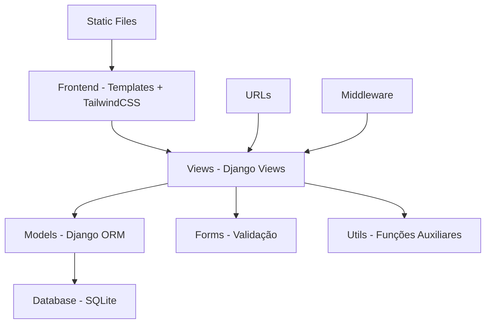
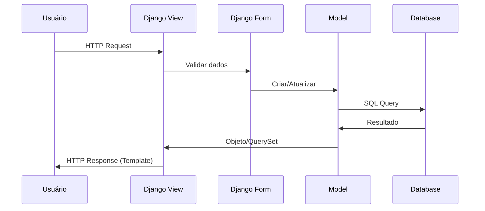
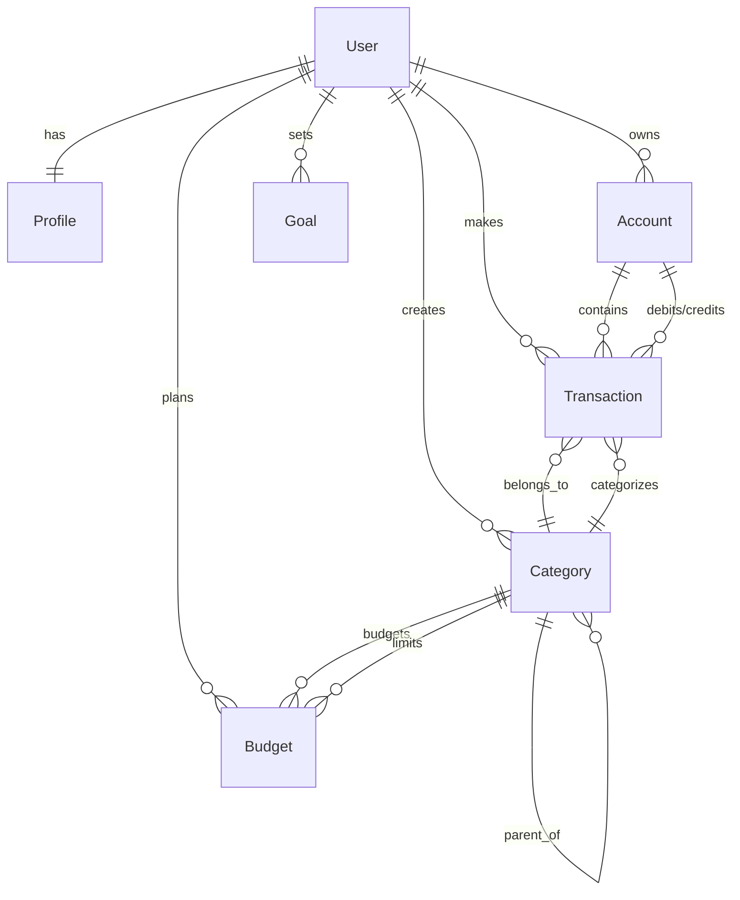

# Arquitetura do Projeto - Finanpy

Este documento descreve a arquitetura geral do sistema Finanpy, seus componentes principais e como eles se relacionam.

## 🏗️ Visão Geral da Arquitetura

O Finanpy segue a arquitetura **MVT (Model-View-Template)** do Django, organizada em apps modulares com responsabilidades bem definidas.



## 📦 Estrutura de Apps

### Core Apps (Sistema)
- **`core/`** - Configurações principais do Django
- **`users/`** - Sistema de autenticação customizado
- **`profiles/`** - Perfis de usuário e informações pessoais

### Business Apps (Funcionalidades)
- **`accounts/`** - Contas financeiras (bancárias, cartões)
- **`categories/`** - Categorização de transações
- **`transactions/`** - Registro de movimentações financeiras
- **`budgets/`** - Planejamento orçamentário
- **`goals/`** - Metas e objetivos financeiros

## 🔄 Fluxo de Dados



## 🗃️ Camada de Dados (Models)

### Relacionamentos Principais



### Hierarquia de Models

1. **User** (Django Auth)
   - Base para todo sistema
   - Autenticação e autorização

2. **Profile** (1:1 com User)
   - Dados pessoais complementares
   - Preferências do usuário

3. **Account** (N:1 com User)
   - Contas bancárias e cartões
   - Controle de saldo

4. **Category** (N:1 com User)
   - Organização de transações
   - Suporte hierárquico (parent/child)

5. **Transaction** (N:1 com User, Account, Category)
   - Movimentações financeiras
   - Receitas e despesas

6. **Budget** (N:1 com User, Category)
   - Planejamento de gastos
   - Controle orçamentário

7. **Goal** (N:1 com User)
   - Metas financeiras
   - Objetivos de economia

## 🎯 Camada de Negócio (Views e Services)

### Tipos de Views Utilizadas

1. **Class-Based Views (CBV)**
   ```python
   # Padrão principal do projeto
   class TransactionListView(LoginRequiredMixin, ListView):
       model = Transaction
       template_name = 'transactions/list.html'
       paginate_by = 20
   ```

2. **Function-Based Views (FBV)**
   ```python
   # Para casos específicos ou AJAX
   @login_required
   def dashboard_data(request):
       return JsonResponse({
           'balance': calculate_balance(request.user)
       })
   ```

### Services Layer (utils.py)

```python
# Lógica de negócio complexa isolada em utils
def calculate_user_balance(user, start_date=None, end_date=None):
    """Calcula saldo total do usuário com filtros opcionais."""
    pass

def process_recurring_transactions():
    """Processa transações recorrentes automáticas."""
    pass

def generate_budget_report(user, month, year):
    """Gera relatório de execução orçamentária."""
    pass
```

## 🎨 Camada de Apresentação (Templates)

### Hierarquia de Templates

```
templates/
├── base.html                 # Template base
├── components/              # Componentes reutilizáveis
│   ├── navbar.html
│   ├── sidebar.html
│   ├── pagination.html
│   └── modal.html
├── accounts/
│   ├── account_list.html
│   ├── account_form.html
│   └── account_detail.html
├── transactions/
│   ├── transaction_list.html
│   ├── transaction_form.html
│   └── transaction_detail.html
└── dashboard/
    ├── home.html
    └── reports.html
```

### Sistema de Componentes

```html
<!-- base.html -->
<!DOCTYPE html>
<html lang="pt-BR" class="dark">
<head>
    
</head>
<body class="bg-gray-900 text-white">
    
    
    <main class="container mx-auto px-4 py-8">
        
    </main>
    
    
    
</body>
</html>
```

## 🔐 Segurança e Autorização

### Middleware Stack
```python
MIDDLEWARE = [
    'django.middleware.security.SecurityMiddleware',
    'django.contrib.sessions.middleware.SessionMiddleware',
    'django.middleware.common.CommonMiddleware',
    'django.middleware.csrf.CsrfViewMiddleware',
    'django.contrib.auth.middleware.AuthenticationMiddleware',
    'django.contrib.messages.middleware.MessageMiddleware',
    'django.middleware.clickjacking.XFrameOptionsMiddleware',
]
```

### Controle de Acesso
```python
# Mixins para controle de acesso
class OwnerRequiredMixin:
    """Garante que usuário só acesse seus próprios dados."""
    
    def get_queryset(self):
        return super().get_queryset().filter(user=self.request.user)

# Decorators para views
@login_required
@user_passes_test(lambda u: u.is_active)
def protected_view(request):
    pass
```

### Validação de Dados
```python
# Forms com validação customizada
class TransactionForm(forms.ModelForm):
    def clean_amount(self):
        amount = self.cleaned_data.get('amount')
        if amount <= 0:
            raise forms.ValidationError("Valor deve ser positivo.")
        return amount
    
    def clean(self):
        # Validações que dependem de múltiplos campos
        cleaned_data = super().clean()
        # ... validações customizadas
        return cleaned_data
```

## 📊 Gerenciamento de Estado

### Session Management
```python
# Dados temporários na sessão
request.session['filter_preferences'] = {
    'date_range': '30_days',
    'categories': [1, 2, 3]
}
```

### Cache Strategy
```python
from django.core.cache import cache

def expensive_calculation(user_id):
    cache_key = f'balance_{user_id}'
    result = cache.get(cache_key)
    
    if result is None:
        result = calculate_complex_balance(user_id)
        cache.set(cache_key, result, 300)  # 5 minutos
    
    return result
```

## 🚀 Performance e Otimização

### Database Optimization
```python
# Select related para evitar N+1 queries
queryset = Transaction.objects.select_related(
    'account', 'category'
).prefetch_related(
    'category__parent'
)

# Agregações no banco
summary = Transaction.objects.filter(
    user=user
).aggregate(
    total_income=Sum('amount', filter=Q(transaction_type='income')),
    total_expense=Sum('amount', filter=Q(transaction_type='expense'))
)
```

### Frontend Performance
```javascript
// Lazy loading de gráficos
document.addEventListener('DOMContentLoaded', function() {
    const chartContainer = document.getElementById('chart-container');
    
    if (chartContainer && isElementInViewport(chartContainer)) {
        loadChart(chartContainer.dataset.chartUrl);
    }
});

// Debounce para filtros
const debouncedFilter = debounce(function(query) {
    filterTransactions(query);
}, 300);
```

## 🔄 Integração e APIs

### Internal APIs (AJAX)
```python
# URLs para endpoints internos
urlpatterns = [
    path('api/balance/', views.balance_api, name='balance_api'),
    path('api/transactions/', views.transactions_api, name='transactions_api'),
    path('api/charts/monthly/', views.monthly_chart_api, name='monthly_chart'),
]
```

### Data Exchange
```python
# Serialização de dados para frontend
def transaction_to_dict(transaction):
    return {
        'id': transaction.id,
        'description': transaction.description,
        'amount': float(transaction.amount),
        'date': transaction.transaction_date.isoformat(),
        'category': transaction.category.name,
        'account': transaction.account.name,
    }
```

## 📱 Responsive Design

### Breakpoints Strategy
```css
/* Mobile First com TailwindCSS */
.container {
    @apply px-4;          /* Mobile */
    @apply md:px-6;       /* Tablet */
    @apply lg:px-8;       /* Desktop */
    @apply xl:px-12;      /* Large Desktop */
}

/* Grid responsivo */
.transaction-grid {
    @apply grid grid-cols-1;      /* Mobile: 1 coluna */
    @apply md:grid-cols-2;        /* Tablet: 2 colunas */
    @apply lg:grid-cols-3;        /* Desktop: 3 colunas */
}
```

### JavaScript Responsivo
```javascript
// Adaptação baseada no tamanho da tela
function adaptLayout() {
    const isMobile = window.innerWidth < 768;
    
    if (isMobile) {
        showMobileNavigation();
        loadMobileChart();
    } else {
        showDesktopNavigation();
        loadDesktopChart();
    }
}
```

## 🧪 Testabilidade

### Test Architecture
```python
# Estrutura de testes por camada
tests/
├── test_models.py        # Testes de models e regras de negócio
├── test_views.py         # Testes de views e respostas HTTP
├── test_forms.py         # Testes de validação de forms
├── test_utils.py         # Testes de funções auxiliares
└── test_integration.py   # Testes de integração end-to-end
```

### Mock Strategy
```python
from unittest.mock import patch, MagicMock

class TransactionServiceTest(TestCase):
    @patch('accounts.services.send_notification')
    def test_transaction_creates_notification(self, mock_send):
        transaction = create_transaction()
        self.assertTrue(mock_send.called)
```

## 📈 Monitoramento e Logs

### Logging Strategy
```python
import logging

logger = logging.getLogger(__name__)

def process_transaction(transaction_data):
    logger.info(f"Processing transaction: {transaction_data['id']}")
    
    try:
        result = perform_transaction_logic()
        logger.info(f"Transaction {transaction_data['id']} processed successfully")
        return result
    except Exception as e:
        logger.error(f"Failed to process transaction {transaction_data['id']}: {str(e)}")
        raise
```

### Error Handling
```python
# Middleware customizado para tratamento de erros
class ErrorHandlingMiddleware:
    def __init__(self, get_response):
        self.get_response = get_response

    def __call__(self, request):
        try:
            response = self.get_response(request)
            return response
        except Exception as e:
            logger.error(f"Unhandled error: {str(e)}", exc_info=True)
            return render(request, '500.html', status=500)
```

## 🔮 Extensibilidade

### Plugin Architecture
```python
# Base para plugins futuros
class BaseFinancialPlugin:
    def __init__(self, user):
        self.user = user
    
    def process_data(self, data):
        raise NotImplementedError
    
    def get_insights(self):
        raise NotImplementedError

# Implementações específicas
class BudgetAnalysisPlugin(BaseFinancialPlugin):
    def process_data(self, transactions):
        # Análise específica de orçamento
        pass
```

### Configuration Management
```python
# Settings dinâmicos por usuário
class UserSettings(models.Model):
    user = models.OneToOneField(User, on_delete=models.CASCADE)
    preferences = models.JSONField(default=dict)
    
    def get_preference(self, key, default=None):
        return self.preferences.get(key, default)
    
    def set_preference(self, key, value):
        self.preferences[key] = value
        self.save()
```

---

Esta arquitetura permite:
- ✅ **Escalabilidade** - Apps modulares e independentes
- ✅ **Manutenibilidade** - Código organizado e testável
- ✅ **Performance** - Otimizações de banco e cache
- ✅ **Segurança** - Controle de acesso robusto
- ✅ **Extensibilidade** - Fácil adição de funcionalidades