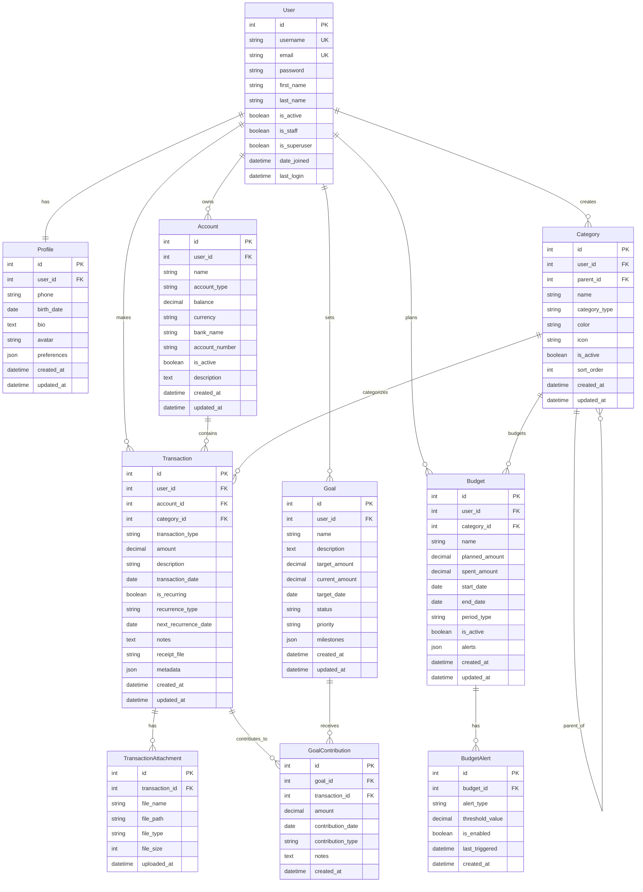

# Estrutura do Banco de Dados - Finanpy

Este documento detalha a estrutura completa do banco de dados do Finanpy, incluindo todos os modelos, relacionamentos e constraints.

## 🗄️ Diagrama Entidade-Relacionamento



## 📋 Detalhamento dos Modelos

### 👤 User (Django Auth)
```python
# Utiliza o modelo User padrão do Django
class User(AbstractUser):
    # Campos herdados:
    # - id, username, email, password
    # - first_name, last_name
    # - is_active, is_staff, is_superuser
    # - date_joined, last_login
    pass
```

**Constraints:**
- `username` único
- `email` único e obrigatório
- `password` com validação de complexidade

### 👥 Profile
```python
class Profile(models.Model):
    user = models.OneToOneField(User, on_delete=models.CASCADE)
    phone = models.CharField(max_length=20, blank=True)
    birth_date = models.DateField(null=True, blank=True)
    bio = models.TextField(max_length=500, blank=True)
    avatar = models.ImageField(upload_to='avatars/', blank=True)
    preferences = models.JSONField(default=dict)  # Configurações do usuário
    created_at = models.DateTimeField(auto_now_add=True)
    updated_at = models.DateTimeField(auto_now=True)
```

**Preferences JSON Structure:**
```json
{
  "theme": "dark",
  "language": "pt-BR",
  "currency": "BRL",
  "date_format": "dd/mm/yyyy",
  "notifications": {
    "email": true,
    "budget_alerts": true,
    "goal_reminders": true
  },
  "dashboard": {
    "default_period": "current_month",
    "show_balance": true,
    "favorite_charts": ["balance_trend", "category_breakdown"]
  }
}
```

### 🏦 Account
```python
class Account(models.Model):
    ACCOUNT_TYPES = [
        ('checking', 'Conta Corrente'),
        ('savings', 'Poupança'),
        ('credit_card', 'Cartão de Crédito'),
        ('debit_card', 'Cartão de Débito'),
        ('investment', 'Investimento'),
        ('cash', 'Dinheiro'),
        ('other', 'Outros'),
    ]
    
    user = models.ForeignKey(User, on_delete=models.CASCADE)
    name = models.CharField(max_length=100)
    account_type = models.CharField(max_length=20, choices=ACCOUNT_TYPES)
    balance = models.DecimalField(max_digits=12, decimal_places=2)
    currency = models.CharField(max_length=3, default='BRL')
    bank_name = models.CharField(max_length=100, blank=True)
    account_number = models.CharField(max_length=50, blank=True)
    is_active = models.BooleanField(default=True)
    description = models.TextField(blank=True)
    created_at = models.DateTimeField(auto_now_add=True)
    updated_at = models.DateTimeField(auto_now=True)
```

**Indexes:**
```sql
CREATE INDEX account_user_active_idx ON accounts_account (user_id, is_active);
CREATE INDEX account_type_idx ON accounts_account (account_type);
```

### 🏷️ Category
```python
class Category(models.Model):
    CATEGORY_TYPES = [
        ('income', 'Receita'),
        ('expense', 'Despesa'),
    ]
    
    user = models.ForeignKey(User, on_delete=models.CASCADE)
    parent = models.ForeignKey('self', null=True, blank=True, on_delete=models.CASCADE)
    name = models.CharField(max_length=100)
    category_type = models.CharField(max_length=10, choices=CATEGORY_TYPES)
    color = models.CharField(max_length=7, default='#6B7280')  # Hex color
    icon = models.CharField(max_length=50, blank=True)  # Font Awesome icon
    is_active = models.BooleanField(default=True)
    sort_order = models.IntegerField(default=0)
    created_at = models.DateTimeField(auto_now_add=True)
    updated_at = models.DateTimeField(auto_now=True)
```

**Hierarquia de Categorias:**
```
Receitas
├── Salário
├── Freelance
└── Investimentos
    ├── Dividendos
    ├── Juros
    └── Ganho de Capital

Despesas
├── Moradia
│   ├── Aluguel
│   ├── Condomínio
│   └── IPTU
├── Alimentação
│   ├── Supermercado
│   ├── Restaurantes
│   └── Delivery
└── Transporte
    ├── Combustível
    ├── Uber
    └── Transporte Público
```

### 💰 Transaction
```python
class Transaction(models.Model):
    TRANSACTION_TYPES = [
        ('income', 'Receita'),
        ('expense', 'Despesa'),
        ('transfer', 'Transferência'),
    ]
    
    RECURRENCE_TYPES = [
        ('weekly', 'Semanal'),
        ('monthly', 'Mensal'),
        ('quarterly', 'Trimestral'),
        ('yearly', 'Anual'),
    ]
    
    user = models.ForeignKey(User, on_delete=models.CASCADE)
    account = models.ForeignKey(Account, on_delete=models.CASCADE)
    category = models.ForeignKey(Category, on_delete=models.SET_NULL, null=True)
    transaction_type = models.CharField(max_length=10, choices=TRANSACTION_TYPES)
    amount = models.DecimalField(max_digits=12, decimal_places=2)
    description = models.CharField(max_length=200)
    transaction_date = models.DateField()
    is_recurring = models.BooleanField(default=False)
    recurrence_type = models.CharField(max_length=10, choices=RECURRENCE_TYPES, blank=True)
    next_recurrence_date = models.DateField(null=True, blank=True)
    notes = models.TextField(blank=True)
    receipt_file = models.FileField(upload_to='receipts/', blank=True)
    metadata = models.JSONField(default=dict)  # Dados extras
    created_at = models.DateTimeField(auto_now_add=True)
    updated_at = models.DateTimeField(auto_now=True)
```

**Metadata JSON Examples:**
```json
{
  "location": {
    "latitude": -23.550520,
    "longitude": -46.633308,
    "address": "São Paulo, SP"
  },
  "tags": ["urgente", "parcelado"],
  "payment_method": "credit_card",
  "installments": {
    "current": 1,
    "total": 12,
    "amount": 150.00
  },
  "external_id": "bank_transaction_123456"
}
```

**Indexes:**
```sql
CREATE INDEX transaction_user_date_idx ON transactions_transaction (user_id, transaction_date DESC);
CREATE INDEX transaction_account_idx ON transactions_transaction (account_id);
CREATE INDEX transaction_category_idx ON transactions_transaction (category_id);
CREATE INDEX transaction_type_idx ON transactions_transaction (transaction_type);
CREATE INDEX transaction_recurring_idx ON transactions_transaction (is_recurring, next_recurrence_date);
```

### 📊 Budget
```python
class Budget(models.Model):
    PERIOD_TYPES = [
        ('monthly', 'Mensal'),
        ('quarterly', 'Trimestral'),
        ('yearly', 'Anual'),
        ('custom', 'Personalizado'),
    ]
    
    user = models.ForeignKey(User, on_delete=models.CASCADE)
    category = models.ForeignKey(Category, on_delete=models.CASCADE)
    name = models.CharField(max_length=100)
    planned_amount = models.DecimalField(max_digits=12, decimal_places=2)
    spent_amount = models.DecimalField(max_digits=12, decimal_places=2, default=0)
    start_date = models.DateField()
    end_date = models.DateField()
    period_type = models.CharField(max_length=10, choices=PERIOD_TYPES)
    is_active = models.BooleanField(default=True)
    alerts = models.JSONField(default=dict)  # Configurações de alerta
    created_at = models.DateTimeField(auto_now_add=True)
    updated_at = models.DateTimeField(auto_now=True)
```

**Alerts JSON Structure:**
```json
{
  "thresholds": [
    {"percentage": 50, "enabled": true, "triggered": false},
    {"percentage": 80, "enabled": true, "triggered": false},
    {"percentage": 100, "enabled": true, "triggered": false}
  ],
  "email_notifications": true,
  "push_notifications": true
}
```

### 🎯 Goal
```python
class Goal(models.Model):
    STATUS_CHOICES = [
        ('active', 'Ativa'),
        ('completed', 'Concluída'),
        ('paused', 'Pausada'),
        ('cancelled', 'Cancelada'),
    ]
    
    PRIORITY_CHOICES = [
        ('low', 'Baixa'),
        ('medium', 'Média'),
        ('high', 'Alta'),
        ('urgent', 'Urgente'),
    ]
    
    user = models.ForeignKey(User, on_delete=models.CASCADE)
    name = models.CharField(max_length=100)
    description = models.TextField(blank=True)
    target_amount = models.DecimalField(max_digits=12, decimal_places=2)
    current_amount = models.DecimalField(max_digits=12, decimal_places=2, default=0)
    target_date = models.DateField()
    status = models.CharField(max_length=10, choices=STATUS_CHOICES, default='active')
    priority = models.CharField(max_length=10, choices=PRIORITY_CHOICES, default='medium')
    milestones = models.JSONField(default=list)  # Marcos intermediários
    created_at = models.DateTimeField(auto_now_add=True)
    updated_at = models.DateTimeField(auto_now=True)
```

**Milestones JSON Structure:**
```json
[
  {
    "percentage": 25,
    "amount": 2500.00,
    "description": "Primeira meta parcial",
    "achieved": true,
    "achieved_date": "2024-03-15"
  },
  {
    "percentage": 50,
    "amount": 5000.00,
    "description": "Metade do caminho",
    "achieved": false,
    "achieved_date": null
  }
]
```

## 🔗 Modelos de Relacionamento

### 📎 TransactionAttachment
```python
class TransactionAttachment(models.Model):
    transaction = models.ForeignKey(Transaction, on_delete=models.CASCADE, related_name='attachments')
    file_name = models.CharField(max_length=255)
    file_path = models.FileField(upload_to='transaction_attachments/')
    file_type = models.CharField(max_length=50)
    file_size = models.IntegerField()
    uploaded_at = models.DateTimeField(auto_now_add=True)
```

### 🚨 BudgetAlert
```python
class BudgetAlert(models.Model):
    ALERT_TYPES = [
        ('percentage', 'Percentual'),
        ('amount', 'Valor'),
        ('remaining', 'Valor Restante'),
    ]
    
    budget = models.ForeignKey(Budget, on_delete=models.CASCADE, related_name='budget_alerts')
    alert_type = models.CharField(max_length=20, choices=ALERT_TYPES)
    threshold_value = models.DecimalField(max_digits=12, decimal_places=2)
    is_enabled = models.BooleanField(default=True)
    last_triggered = models.DateTimeField(null=True, blank=True)
    created_at = models.DateTimeField(auto_now_add=True)
```

### 💝 GoalContribution
```python
class GoalContribution(models.Model):
    CONTRIBUTION_TYPES = [
        ('manual', 'Manual'),
        ('automatic', 'Automática'),
        ('transaction_link', 'Vinculada à Transação'),
    ]
    
    goal = models.ForeignKey(Goal, on_delete=models.CASCADE, related_name='contributions')
    transaction = models.ForeignKey(Transaction, on_delete=models.SET_NULL, null=True, blank=True)
    amount = models.DecimalField(max_digits=12, decimal_places=2)
    contribution_date = models.DateField()
    contribution_type = models.CharField(max_length=20, choices=CONTRIBUTION_TYPES)
    notes = models.TextField(blank=True)
    created_at = models.DateTimeField(auto_now_add=True)
```

## 📈 Views Calculadas (Database Views)

### Monthly Summary View
```sql
CREATE VIEW monthly_summary AS
SELECT 
    user_id,
    EXTRACT(YEAR FROM transaction_date) as year,
    EXTRACT(MONTH FROM transaction_date) as month,
    SUM(CASE WHEN transaction_type = 'income' THEN amount ELSE 0 END) as total_income,
    SUM(CASE WHEN transaction_type = 'expense' THEN amount ELSE 0 END) as total_expense,
    SUM(CASE WHEN transaction_type = 'income' THEN amount ELSE -amount END) as net_amount,
    COUNT(*) as transaction_count
FROM transactions_transaction 
GROUP BY user_id, EXTRACT(YEAR FROM transaction_date), EXTRACT(MONTH FROM transaction_date);
```

### Category Summary View
```sql
CREATE VIEW category_summary AS
SELECT 
    c.user_id,
    c.id as category_id,
    c.name as category_name,
    c.category_type,
    COUNT(t.id) as transaction_count,
    COALESCE(SUM(t.amount), 0) as total_amount,
    AVG(t.amount) as average_amount
FROM categories_category c
LEFT JOIN transactions_transaction t ON c.id = t.category_id
WHERE c.is_active = true
GROUP BY c.user_id, c.id, c.name, c.category_type;
```

## 🔍 Principais Queries e Otimizações

### Query para Dashboard
```sql
-- Balance total por usuário
SELECT 
    u.id as user_id,
    COALESCE(SUM(a.balance), 0) as total_balance,
    COUNT(a.id) as account_count
FROM auth_user u
LEFT JOIN accounts_account a ON u.id = a.user_id AND a.is_active = true
WHERE u.id = %s
GROUP BY u.id;

-- Transações recentes
SELECT 
    t.id,
    t.description,
    t.amount,
    t.transaction_date,
    t.transaction_type,
    a.name as account_name,
    c.name as category_name,
    c.color as category_color
FROM transactions_transaction t
INNER JOIN accounts_account a ON t.account_id = a.id
LEFT JOIN categories_category c ON t.category_id = c.id
WHERE t.user_id = %s
ORDER BY t.transaction_date DESC, t.created_at DESC
LIMIT 10;
```

### Query para Relatórios
```sql
-- Gastos por categoria no mês
SELECT 
    c.name as category_name,
    c.color as category_color,
    SUM(t.amount) as total_amount,
    COUNT(t.id) as transaction_count,
    AVG(t.amount) as average_amount
FROM categories_category c
INNER JOIN transactions_transaction t ON c.id = t.category_id
WHERE t.user_id = %s
    AND t.transaction_type = 'expense'
    AND t.transaction_date >= %s
    AND t.transaction_date <= %s
GROUP BY c.id, c.name, c.color
ORDER BY total_amount DESC;
```

## 🗂️ Índices Recomendados

```sql
-- Índices para performance
CREATE INDEX CONCURRENTLY user_active_accounts_idx ON accounts_account (user_id) WHERE is_active = true;
CREATE INDEX CONCURRENTLY user_active_categories_idx ON categories_category (user_id) WHERE is_active = true;
CREATE INDEX CONCURRENTLY transaction_date_range_idx ON transactions_transaction (user_id, transaction_date, transaction_type);
CREATE INDEX CONCURRENTLY budget_period_idx ON budgets_budget (user_id, start_date, end_date) WHERE is_active = true;
CREATE INDEX CONCURRENTLY goal_status_idx ON goals_goal (user_id, status);

-- Índices para full-text search
CREATE INDEX CONCURRENTLY transaction_description_search_idx ON transactions_transaction USING gin(to_tsvector('portuguese', description));
```

## 🔄 Triggers e Stored Procedures

### Atualização de Saldo de Conta
```sql
CREATE OR REPLACE FUNCTION update_account_balance()
RETURNS TRIGGER AS $$
BEGIN
    IF TG_OP = 'INSERT' THEN
        UPDATE accounts_account 
        SET balance = balance + 
            CASE 
                WHEN NEW.transaction_type = 'income' THEN NEW.amount
                WHEN NEW.transaction_type = 'expense' THEN -NEW.amount
                ELSE 0 
            END
        WHERE id = NEW.account_id;
        RETURN NEW;
    END IF;
    
    IF TG_OP = 'DELETE' THEN
        UPDATE accounts_account 
        SET balance = balance - 
            CASE 
                WHEN OLD.transaction_type = 'income' THEN OLD.amount
                WHEN OLD.transaction_type = 'expense' THEN -OLD.amount
                ELSE 0 
            END
        WHERE id = OLD.account_id;
        RETURN OLD;
    END IF;
    
    RETURN NULL;
END;
$$ LANGUAGE plpgsql;

CREATE TRIGGER transaction_balance_trigger
    AFTER INSERT OR DELETE ON transactions_transaction
    FOR EACH ROW EXECUTE FUNCTION update_account_balance();
```

### Atualização de Valor Gasto no Orçamento
```sql
CREATE OR REPLACE FUNCTION update_budget_spent()
RETURNS TRIGGER AS $$
BEGIN
    IF TG_OP = 'INSERT' AND NEW.transaction_type = 'expense' THEN
        UPDATE budgets_budget 
        SET spent_amount = spent_amount + NEW.amount
        WHERE category_id = NEW.category_id 
            AND user_id = NEW.user_id
            AND NEW.transaction_date BETWEEN start_date AND end_date
            AND is_active = true;
        RETURN NEW;
    END IF;
    
    RETURN NULL;
END;
$$ LANGUAGE plpgsql;

CREATE TRIGGER budget_spent_trigger
    AFTER INSERT ON transactions_transaction
    FOR EACH ROW EXECUTE FUNCTION update_budget_spent();
```

## 📊 Constraints e Validações

### Check Constraints
```sql
-- Valores não podem ser negativos
ALTER TABLE transactions_transaction 
ADD CONSTRAINT positive_amount CHECK (amount > 0);

ALTER TABLE accounts_account 
ADD CONSTRAINT balance_limit CHECK (balance >= -999999999.99);

-- Datas de orçamento devem ser válidas
ALTER TABLE budgets_budget 
ADD CONSTRAINT valid_budget_dates CHECK (start_date <= end_date);

-- Metas devem ter valores positivos
ALTER TABLE goals_goal 
ADD CONSTRAINT positive_goal_amounts CHECK (target_amount > 0 AND current_amount >= 0);
```

### Unique Constraints
```sql
-- Não pode ter orçamento duplicado para mesma categoria e período
ALTER TABLE budgets_budget 
ADD CONSTRAINT unique_category_period UNIQUE (user_id, category_id, start_date, end_date);

-- Nome de conta único por usuário
ALTER TABLE accounts_account 
ADD CONSTRAINT unique_account_name_per_user UNIQUE (user_id, name);
```

---

Esta estrutura garante:
- ✅ **Integridade referencial** completa
- ✅ **Performance otimizada** com índices adequados
- ✅ **Escalabilidade** para milhares de usuários
- ✅ **Flexibilidade** para futuras extensões
- ✅ **Auditoria** com timestamps em todas as tabelas